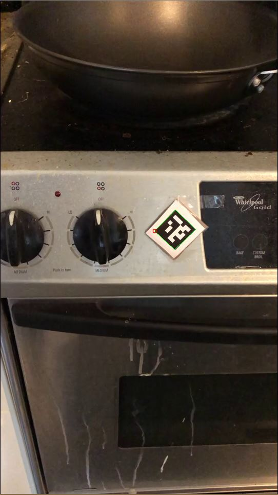
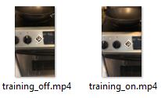
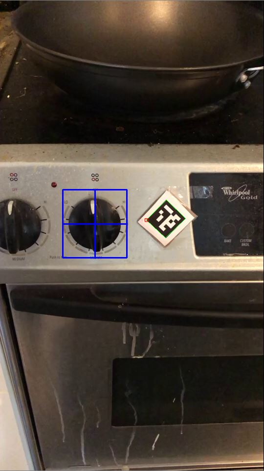
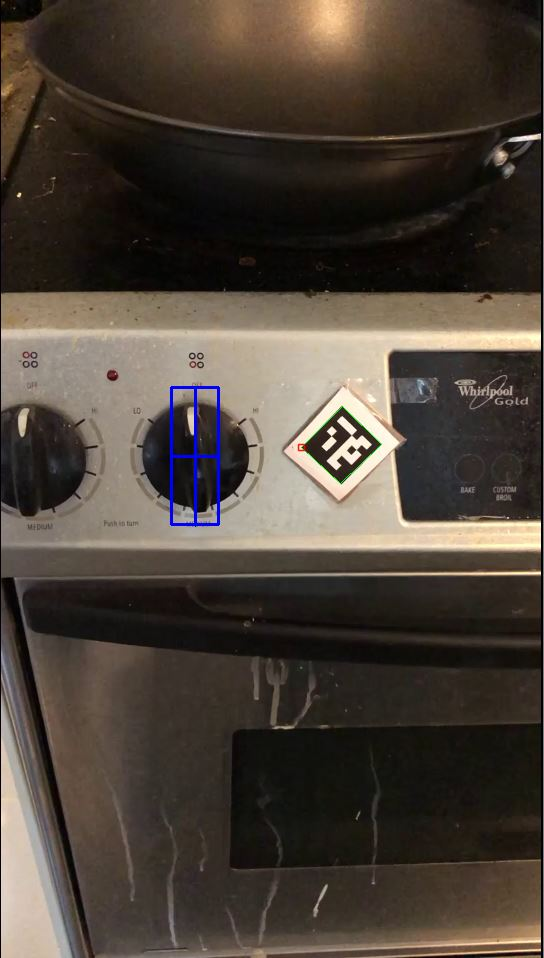

# Detecting Stovetop Status with OpenCV and ARUCO Marker

This demo serves as the first step towards constructing a vision-based smart reminder for vulnerable populations like older adults and people with vision impairments. An envisioned use case is that when the user forgets to turn off the stove, the smart reminder will be able to alert the user immediately. We can definitely extend the application to detecting the on/off state of a TV or the on/off state of a light switch in the future. 

**Step 1:** Place an ARUCO marker on the stove, ideally next to the stove knob.

  

**Step 2:** Shoot videos of different stove top status. One for stove-off and the other for stove-on. Save the videos under the folder stove pics.

  

**Step 3:** Select a region of interest you would like the system to track. You can select whatever you want, but it's best to select the region of interest that changes the most between two different states (on and off), for example, the turning of a stove knob. The more precise the selection, the accurate the classification can be.

  
  &nbsp &nbsp &nbsp &nbsp &nbsp &nbsp
  

**Step 4:** Let the system process the video data. The algorithm will resize each video frame into 32 pixels by 32 pixels, so we have 1032 feature dimensions to work with. I chose 32x32 for faster processing, but this dimension can definitely be changed.

**Step 5:** Test the system on a newly shot video. The recognition performance can be quite decent as long as the video frames are clear, and there are not many occlusions.

<a href="https://www.youtube.com/watch?v=_EjS_oaIEd0">Test video 1</a>

<a href="https://www.youtube.com/watch?v=JHIc_5RYfXQ">Test video 2</a>
